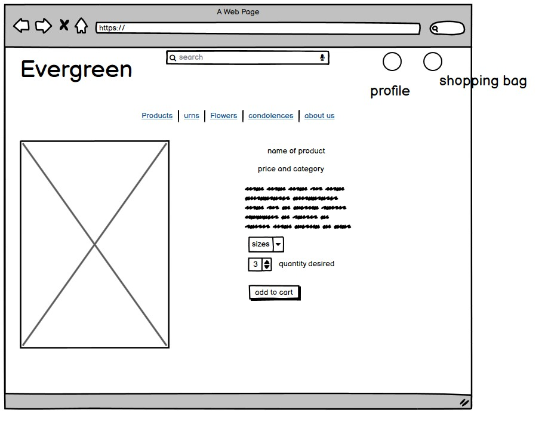

# Evergreen Funeral Home

* [Link to deployed website](https://evergreenfuneralhome.herokuapp.com/)
* [Link to github repository](https://github.com/phoebeireland/codeinstitutemilestoneproject4)

# Contents

1. UX
2. The Website
3. Testing the Site
4. Deployment
5. Credits

# UX

## The Project- Purpose and Business Goals

This Website aims to inform users about the Evergreen Funeral Home, as well as offering them the ability to browse various funeral options such as urns, cremation and coffins. As it is, the website is mostly store-based, with the main focus on the funeral products that are available for purchase. The main purpose of the website is commercial, though the people visiting the website can also find out some information regarding the funeral home, as well as offer condolences on the blog page that posts news of local deaths and upcoming services. The website is accessible to users who have a 'profile' on the site and to those who do not. The difference between a user who has an account versus one who does not, is that the user with an account is able to access their profile and review past orders made through the site. Although a user may use the condolences blog with an account, an account is not necessary for leaving a comment. Furthermore, for a user who is a superuser, they gain further access to the admin side of the website, where they can approve new comments to the condolences blog posts. Furthermore, when a user is logged into the superuser accont, they had an additional option in the "My Profile" dropdown menu for 'Product Management', where they are able to add a new product without haveing to navigate to the full admin interface. Another unique ability for a superuser is that on both the product pages and the blog pages, they are able to edit, delete and, in the case of the blog, they are able to add a new blog post. Once again, this option bypasses the need for a superuser to go to the full admin dashboard to perform these functions.

## User Stories
A New User to the site wants:
1. An easily navigatable website and shopping area
2. The ability to buy products for an upcoming funeral
3. An area to find out a bit of information about the funeral home and those who work in it
4. A nice arrangement of product options
5. The ability to see what services are coming up, and offer condolences to those who died
6. The ability to pay on the website itself, and be able to recieve confirmation emails regarding the order
7. The ability to create an account to keep track of any purchases made

A Returning User to the site wants:
1. An easily navigatable website so I can find my created profile
2. The ability to look back on previous orders that were made
3. The ability to save contact/delivery details for an easier checkout in the future
4. The ability to search for a product or category of products if the specific name of a previously found product escapes my mind
5. The ability to sort the products based on certaion criteria. (ie. by price or name)

## Design Choices

The overall feel of the Website should be somber and clean. As a lot of the code for the project was modeled after the Boutique Ado project that was shown in the Code Institute videos, styilistically, not much differs between that site and this funeral site. Obviously elements were altered to make the design fit a funeral website rather than a clothing and housewares shop, but the main style features remained largely the same. 

### Font

The font used on this Website is Lato. Rather than picking a different, more fancy font from Google Fonts, I felt that the built-in font of Lato fit the website's overall aesthetic to the degree that looking elsewhere was not necessary. The alternative font that was considered, 'Zen Antique', was deemed to be unsuitable for the overall aestethic of the website, and as such, was scrapped for the original choice of 'Lato'.

### Colours

The main colours used on the site are:
* Black, for the colour of the profile and shopping icons at the top of the page, as well as some of the navigational buttons across the site.
* Hex color `#555` for the remaining font present elsewhere on the site.
* White, for the font on the buttons which have black backgrounds, as well as for the beneral background overlay colour on all of the pages that are not the `index.html` page.
* `rgb(14, 221, 66)` for the color of the footer elements when they are not being hovered over, and `rgb(179, 1, 1)` for the footer elements when they are being hovered over.

### Styling

The Website is built to be a funeral website. As such, loud, brash, and gaudy stylistic elements would be wildly inappropriate considering the purpose of the website. Due to this, the website has a clean and simple look that, with the white background and the grey font colour, aims to be reminiscent of a marble mausoleum. Due to the nature of most of the pages- since they contain a lot of important information, the only pages that retain the original background image on the site are the About page and the Homepage of teh website. It seemed most prudent to leave the rest of the pages with a simple white background, since certain pages- like the products page or the checkout page- contained information that was the main focus of the page, it felt as though leaving a background like that of the flower would only serve to distract the user, which would be detrimental to the functionality of the website. Funerals and death in general are somber matters, so to have a website that reflects the seriousness of the topic at hand seemed very important. An additional Django library was used to change alter the look of both the prices of products and the provided dates and times for the blog. The library used was [django.contrib.humanize](https://docs.djangoproject.com/en/3.2/ref/contrib/humanize). This was used to add commas to the individual and overall prices of products that were over a thousand dollars, as django did not automatically add one in. It also altered the dates on the blog posts that were automatically added when the post was submitted to the website. These changes were deemed necessary to improve the ease of viewing for any user, as they reflected a more natural way of processing the secific information provided.

## Wireframe Designs
Provided additional information regarding the wireframes below each picture. Refer to them to explain where a wireframe may differ from the published product or for choices behind the designs.
As will be noticed, as the site is modeled after the Boutique Ado project supplied by Code Institute, the wireframes provided reflect this. The pages in which they differ are the original pages- the blog pages and the blog comment pages. 

### Homepage

This image shows the initial idea for the main page of the website. This is the page that the users would see upon inital entry to the website. It is very similar to that of the Boutique Ado page. The places where they differ are in the contents of the navigation bar and the large image that is in the middle of the page.

### General Products Page Design

This image shows the initial idea for all of the product pages on the site. Although the different products would be split into their own pages based on the different categories of products, there seemed to be no need to create a separate weireframe for every product catergory page, as they would all follow the same basic layout, as seen in this wireframe image. Each of the navbar elements would point to a different part of teh website to which the user would have access. As the main purpose of the website was for shopping, the majority of the links provided in the navbar were related to the products available for purchase. On the page itself, the user is presented with an image of the product being offered, as well as the price of the object and the name of the product. 
Added later to the page, was the smaller dropdown menut that gave the user the ability to reorganize the products on the page based on ceratin criteria- such as ranking the products based on their price or alphabetically or by category. 

### Product Detail Page Design

Similar to the way the general product page design did not change per product catergory, the product details page remained the same for every product on the site. This page was split into two halves. The left half of the screen was dedicated to a larger image of the product, while the right half of the screen was dedicated to a short description of the product, as well as it name and the 'add to cart' option for the user. If a product was availble in different sizes, then the option to choose the size that the customer wanted to purchase was available would be visible.

### Condolences Blog Page Design

The general design of the condolences blog was taken from the design provided on [Django Central](https://djangocentral.com/building-a-blog-application-with-django/). The blog page was simple, and adapted to fit the overall look of the Evergreen website to which it was being added. On this page, superusers would be able to add a blog post detailing the passing of a member of the community, and anyone who visited the site, regardless of whether or not they had an account on the website would be able to view the post and offer condolences on the specific post page. If the superuser is logged in, they also have the ability to edit or delete any blog post on the site. Those capabilites were available only to those users who were logged in as a superuser, and were provided as two small links under the main text of the post to which they related. This was another of the pages that used the [django.contrib.humanize](https://docs.djangoproject.com/en/4.0/ref/contrib/humanize/) filter. The `naturalday` filter was applied to the date on the blog post that indicated when each blog post was added to the website. This was added for ease of reading, as it changed the provided date from the strict date and time posted, to "yesterday" or "today" if the posts had been added ether the same day as it was being viewed, or on the previous day. 

### Condolences Comment Page Design

The general design of the condolences comment page was taken from the design provided on [Django Central](https://djangocentral.com/building-a-blog-application-with-django/), and further expanded with the design and code provided on [this page](https://djangocentral.com/creating-comments-system-with-django/). This page has the full condolences message, as the general blog page only has the first few words of the message. The sidebar on the side has instructions on how to add a comment, and in the initial design, the comments form is underneath the sidebar, but in the final design the form ended up being under the comments area, which was under the initial condolences message. Similar to the Condolences page, the post page makes use of [django.contrib.humanize](https://docs.djangoproject.com/en/4.0/ref/contrib/humanize/)'s `naturalday` filter. to alter the timestamp on the comments that are added. One element of the comments form that came with the code that was taken from Django Central, was the fact that once a user pressees "submit", the comment is added to the database, and a superuser has to navigate to the admin dashboard in order to approve the message that was submitted. Although this may seem somewhat tedious, this seemed like a beneficial feature for the website to have, since it would allow the superuser to filter out any spam messages or other messages that could reflect badly on the site, since the blog pages are accessible to any person who accessed the site. 

### About Us Page Design

The design for the About Us Page was very simple, and ended up combining the "About Us" information with the "Our Team" information, as it didn't seem necessary to separate those two into their own pages. This way, the page looks more full, since there is an additional paragraph of writing that would not have otherwise been there. Since this page was fairly simple in design, I felt that the overlay that was blocking the background image of the white flower that was present on the homepage of the website would be appropriate to add back to this page, rather than leaving it with the white background or adding a separate picture to the page.

### Login/Register Page Design

This was the initial design for both the login in and the register account pages. However, they were controlled by the allauth template once that was installed, and I did not alter the template that was already there. As it turns out, there was not much difference between the initial design and what turned out to be published on the site. 

### Shopping Bag Page Design

The design from this page was a simple shopping bag. It displays to the user the items which are currently in their shopping bag waiting to be purchased, and at the bottom of the page offers them the ability to proceed to checkout and purchase their items. The items that are currently in the bag are displayed as a list. The picutre corresponding to the product is displayed, as well as the price of the object (the price may be modified if multiple of the same item are in the shopping bag), the name of the item and the quantity to be bought. 

### Checkout Page Design

This page offers a form into which a user can enter their billing and shipping information and then submit payment to Stripe near the bottom of the page. On the side of the page, the user is still able to see the products that they are purchasing. This is one of the plages which pulls its design directly from the Boutique Ado project. If a user has a profile on the website, then their contact information is taken from the form on the profile page and is auto-filled into the contact form here.

### Order Confirmation Page Design

This page displays the order summary to the user once their payment has been processed. The page is fairly simple, as the only contents present on the page is a summary list of the purchase that was just made. Due to the simplicity of the page and the function it was built to perform, the design for this page was also take directly from the Boutique Ado project.

### Profile Page Design

When a user makes a profile, they are able to save their contact details in a form on the left-hand side of the page, and they are able to review their previous orders on the right-hand side of the page. These elements were taken directly from the Boutique Ado project. The profile page's function is simple. It merely allows a registered user to view past orders that were made and to save their information to the site for a faster checkout in the future. The deisgn for this page was also modeled from the code in the Bouqitue Ado project.

# Features
* At the top of every page on the website, there is a Navbar which will allow users to easily navigate around the websites various pages, as well as a search bar that allows users to search for products in the store. 
* At the top right-hand corner of all of the pages, there is a 'My Profile' icon and a 'Shopping Bag' icon. These are used to access a user's profile page and the logout link, if they are signed in, and the shopping bag in the current session. If a user is logged in and is a superuser, then the Profile icon dropdown menu will include an option called 'Product Management', which will allow the superuser to add a product to the store. 
* At the bottom of every page on the website, there is a footer containing various social media links that allow a user to navigate to that page once clicked. At it is, there are no social media pages directly related to the created website, so the links will take a user to the generic homepage for all of the links. The links included are Facebook, Instagram and Github.
* When the pages are viewd on smaller screens, all of the elements on the pages will stack on top of each other and the navbar will collapse. 
* If a user is signed in as a superuser, then they will have options to edipt or delete products in the shopping area, or to add, edit or delete condolence blog posts.
* In the shop, users have the option to choose the size of the product they are purchasing, if it is available in different sizes, and they are also able to change the number of items being added to the shopping basket, if the user wants to order multiple of the same item.
* When a user adds a product to their bag, or alters their bag in any way, a message box pops up in the top right corner of their screen alerting them of the changes being made.

### The Home Page
* This page is the first page that the users see upon entering the site, and contains a searchbar at the top and a navbar that can be used to go to different pages on the site.
* The navbar is a dropdown navbar that expands to give even more specific options for pages for the user to visit. For example, the "Urns and Coffints" navbar link expands to allow the user to go to the specific "Urns" page or the "Coffins" Page, or the "Miscellaneous" page.
* There are also the two icons that lead users to the login and register pages to createe or login to their profile, and to access the shopping bag with all of their current purchases. 
* The middle of the screen is fairly simple, with a large background image and a single quote. There is also a button that will direct a user to the shop, so that they can browse the products that are available.
* On smaller screens, the navbar will collapse and the elements at the top of the page will stack.

### Products Page
* The general design of the product pages is the same across all of teh different category pages. At the top of the page is a header that specifies which of the pages the user is currently on (ie. the Urns page, or Products Page). 
* The page contains a clickable image of the product that can be used to go to the prodcut details page. 
* Underneath the image of the product is the name of the specific product, and the sales price, without tax added.
* The page contains information for all of the products that are relevant to the category specified. 
* The user has the ability to sort the products on the page by further specifications such as by price, by name, or by category name.
* The page also alerts the user as to how many products are available on that page.
* If a user is a superuser, then there are additional links at the bottom of each product that allows the superuser to edit or delete the product.
* On smaller screens, the elements stach upon each other to allow for easier viewing.

### Product Detail Page
* On the left side of this page is a larger image of the product being looked at, and on the right side of the page are further details about the product.
* There is a short description of the product being viewed, as well as restating the name of the product as well as the price of the object. 
* Below the product description is the dropdown menu that allows a user to change the size of teh product they are interesting in purchasing.
* Below the size, is the quantity adjuster, where a user can opt to add more than one of the same items to their shopping bag. 
* Once the user has selected the size and quantity of the product, there is a button that allows th user to add the item(s) to their bag.
* One an item is added to the bag, a message in the top right corner of their screen pops up and lets the user know that the item was added successfully to their bag.
* On smaller screens, the elements collapse to fit the smaller screen.

### Condolences Blog Page
* This blog has a main column with the blog posts, and a small sidebar with instructions on how to add a condeolence comment to the specific blog psot.
* If a user is a superuser, at the bottom of each blog preview, there are two links to edit or delete the blog post. 
* If a user is a superuser, there is a button beneath the sidebar that allows them to add a post without having to go all the way to the admin dashboard. These buttons and links are not available if the user is not logged into the superuser account.
* The blog posts that are added to the blog are shown on this page in cards that offer a short excerpt of the text of the full post as well as a the name of the poster, and the date on which the post was added to the blog.
* Below the sample of blog text is a button labeled "Read More" that users can use to continue to a page that contains only the blog post and gives them the ability to add their comment to the post.

### Condolences Comment Page
* The page has a similar format to the previous page in that there are two main columns of content. The sidebar is still small and on the right side of the screen. It contains instructions on how to add a comment to the post.
* The card with the condolence message is shown here in its entirety. It also contains the name of the user who posted the message, as well as the date on which it was posted.
* Below the message, is the comment area. This area shows the user how many comments are already on the page as well as displaying the comment messages.
* At the bottom of the page is the form that allows users to attach a comment. This form consists of 3 fields- the commenter's name, email and the message they would like to be displayed on the page. At the bottom of the form is the submit button that will add the comment to the page.
* If the user is a superuser, on the main post block, they have the ability to edit the content of rthe condolence message or delete the post entirely.
* On smaller screens the elements stack.

### About Us Page
* This page has two cards that are side-by-side on larger screens and that stack on smaller ones.
* The card on the left has information regarding the funeral home in general, while the right card offers more specific information regarding the people who work at the funeral home.

### Login/ Register Page
* The login and register pages are very similar in design. The main difference between the two is that the Register page has more form entry fields than the login form. The login form asks for the username and password associate with the account, while the register page asks for an email address too.
* The login page also has a message at the top of the login form that says that if a person is trying to login but does not yet have an account, that they need to sign up first. The words "sign up" in the message are a link that will redirect the user to the register page.
* The register page also has a message at the top of the register form that says that if a person is trying to register a new account but already has an account, then they should go to the sign in page. The words "sign in" are a link that redirects the user to the login page.
* On smaller screens, the navbar collapses and the form centers on the page to fit a smaller screen.

### Shopping Bag Page
* This page shows users what items are currently in their shopping bag waiting to be purchased, and gives them the option to either return to shopping or to proceed to checkout.
* 
* 

### Checkout Page
* 
* 
* 

### Order Confirmation Page
* 
* 
* 

### Profile Page
* 
* 
* 

# Testing the Site

All HTML pages and CSS files were tested using the HTML and CSS Validator from W3.
* Link to the [HTML Validator](https://validator.w3.org./) used
* Link to the [CSS Validator](https://jigsaw.w3.org/css-validator/) used

As the HTML pages on VSCode were written in Django, this made validating the code with the validators significatly more difficult. To get around this, I right-clicked on each page and selected the option 'view page source' and submitted it to the HTML validator.

## Manual Testing

Using the Chrome Inspect tool, the following aspects of the website were tested:
* All of the contents on the pages of the website collapsed correctly when viewed on a smaller screen.
* The footer remained at the bottom of the pages when viewed on a smaller screen.
* The Navbar collapsed correctly when viewed on a smaller screen, and the correct code was there to enable to collapsed menu to expand when clicked. 
* The text within the blog boxes were all still correctly centered on smaller screens just as they were on the larger ones. 
* On the About page, the two card stacked properly when the page was viewed on a smaller screen.
* The blog post cards all stacked and minimised correctly when viewed on a smaller screen.
* The remove link in the shopping bag does remove the indicated item from the bag entirely.
* The quantity buttons work to either increase or decrease the number of the selected item, and cannot be lowered past 1.

## Testing User Stories
### New User:
1. Upon entering the webiste, a navbar is clearly visible at the top of the page, and is accessible across all of the pages of the website. IN addition, there is a search bar at the top of the page which can take a user to a specific product or group of products, based on what the y type intyo the search box.
2. The shop is available through both the main page via the "Visit Shop" button in the middle of the page, and through the various links in the navbar. Also, specific categories of products are available in the navbar, which allows a user to go to specific groups of products, rather than having to sort through the entire list of the products every time.
3. An area to find out a bit of information about the funeral home and those who work in it
4. A nice arrangement of product options
5. The ability to see what services are coming up, and offer condolences to those who died
6. The ability to pay on the website itself, and be able to recieve confirmation emails regarding the order
7. The ability to create an account to keep track of any purchases made

### Returning User
1. An easily navigatable website so I can find my created profile
2. The ability to look back on previous orders that were made
3. The ability to save contact/delivery details for an easier checkout in the future
4. The ability to search for a product or category of products if the specific name of a previously found product escapes my mind
5. The ability to sort the products based on certaion criteria. (ie. by price or name)

## Small Problems (that were fixed)
* In the HTML Validator, it throws an error stating that `id="user-options` is stated twice. This is due to the fact that on the `base.html` page there is a line that calls the `mobile_top_header.html` file. In the rendered html code, this creates two of the same headers, which is why the id turns up twice. To fix this issue, I simply renamed the label in the `mobile_top_header.html`, and the error went away.
* The Footer refused to stay at the bottom of the page on pages where there was not a lot of content. This was fixed by Googling, and landing on [this page](https://dev.to/nehalahmadkhan/how-to-make-footer-stick-to-bottom-of-web-page-3i14). As shown on the page, adding `min-height: 100vh`, `display:flex`, `flex-direction:column` and `margin-top:auto` to the `body` and `footer` styles in `style.css` fixed the problem. It was important to retain the original `height: calc(100vh - 164px);`, otherwise the page looked really weird.

# Deployment
The Website was created in Visual Studio Code, version controlled with Git and hosted on Heroku.

Steps to publish website to Heroku:
1. On Heroku, press "Create a New App"
2. On the new page, type in the app name and select the region for the app. Keep in mind that the app name must be completely original. Then press "Create".
3. Once the page has loaded, under the "Deploy" menu, select "Connect to GitHub", and enter the name of the repository to connect it to Heroku. 
4. Once it is connected, either choose "Automatic deploys" or "Manual deploy" and choose the branch that Heroku will deploy from. 
5. Make sure that there is a Procfile in the root of the directory. If there is not, create a new file and name it `Procfile`, making sure that the first letter is capitalised, otherwise Heroku will not register the file correctly. 
6. Within the Procfile, type: `web: python app.py`. This will tell Heroku exactly what the process type is (in this case it's `web`) and what the command is (`python app.py`)
7. Once the Procfile is created and filled in, push the change to the branch on GitHub that was specified as being the branch to deploy from. If automatic deploys were enabled, Heroku will automatically deploy the changes any time alterations are made to the deployed branch. If Manual deploys were used, you will have to manually deploy every time a large change is made. 
8. Another necessary step is to add the information that is in the `env.py` file to the "Config Vars" section in Heroku. This is necessray, because since the `env.py` file is in a `.gitignore`, it is ignored by GitHub, and therefore is not accessible to Heroku.
9. To add the information to the Config Vars, open the "Settings" section on the app page. Once opened, scroll down to the "Config Vars" area and click on "Reveal Config Vars".
10. Here, you will see two text boxes that say "Key" and "Value" respectively. Into the "Key" side, enter `SECRET_KEY`, `IP`, `PORT`, `MONGO_URI` and `MONGO_DBNAME`. On the "Value" side of each pair, enter the value stated in the `env.py` file and press the "add" button to add each pair. 
11. Once all of the steps are complete, Heroku should be able to publish the website. 

Steps to publish website to GitHub Pages:
1. On the main page of the repository, click settings.
2. Go to the GitHub Pages section on the menu bar to the left.
3. In the Source section, click "None" and change the selected branch to "main". 
4. Leave the following option as (root), and click "Save"
5. Once the repository is published, a link to the website will be shown in the GitHub Pages section. 

To Clone this repository using IDE Terminal:
1. Navigate locally to the directory in which you want to save the repository.
2. On the main page of the repository, click the "Code" button, and copy the HTTPS address.
3. In the terminal, run the command: 'git clone' followed by the HTTPS address.
4. The project will now be saved to the desired directory. 

To Clone this repository using Visual Studio Code:
1. Open a new window in VSCode.
2. On the main page of the repository, click the "Code" button, and copy the HTTPS address.
3. Back in VSCode, under "Start" click "clone repository" and paste the link into the textbox that pops up.
4. Navigate into the folder that you want the repository to be saved into, and "Select Repository Location".
5. The repository will now be saved to the selected location.

# Credits

Created by Phoebe Ireland

The content of this website was created by Phoebe Ireland, with the exception of the following:
* [Unsplash](https://unsplash.com/) and [Pexels](https://www.pexels.com/)
  * Used for the images found on the site
* [Bootstrap](https://getbootstrap.com/)
  * Used to create the majority of the elements in the website including teh navbar and the footer
* [favicon.io](https://favicon.io/)
  * Used to create the favicon
* [jQuery](https://jquery.com/)
  * Uses jQuery for various Bootstrap functions 
* [Balsamiq](https://balsamiq.com/)
  * Used to create the wireframes.
* [Code Institute Boutique Ado Project](https://github.com/Code-Institute-Solutions/boutique_ado_v1)
  * Used to model all of the main shop code for the funeral website.
* [Django Central Blog](https://djangocentral.com/building-a-blog-application-with-django/) and [Django Central Comments](https://djangocentral.com/creating-comments-system-with-django/)
  * Used to create the blog and comments elemnt of the blog for the COndolences pages
* [Django Project](https://docs.djangoproject.com/en/4.0/ref/contrib/humanize/)
  * Used to find the `django.contrib.humanize` code to apply the humanize filters to the prices and the dates
* [Stripe](https://stripe.com/)
  * To process the payments that are made on the site

   All of the content that was taken from other sources was altered to fit the use of this website where necessary.

A special thank you to my mentor for helping me though the project, and pointing out my (numerous) mistakes. 